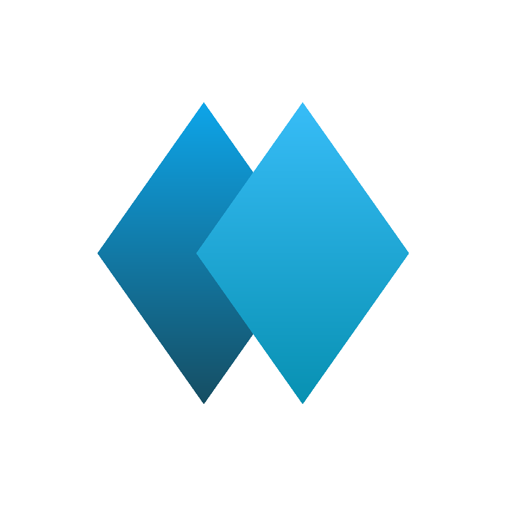

<div align="center">



# HerMemory. **Your memory.**

*Memory that grows with you.*

[](LICENSE)
-22D3EE)


</div>

---

**HerMemory**是基于开源 Hermes 内核深度定制的**独立发行版Agent**，

在保留Hermes全部能力的基础上针对【日常对话&文档写作】做了深度优化。

HerMemory的**一切**都完全属于用户，HerMemory is **Your** memory。

<details>
<summary>📑 目录</summary>

- [✨ 01 · 核心特性](#-01--核心特性)
  - [📄 1. 文件即AI](#-1-文件即ai)
  - [💬 2. 微信对话，扫码即用](#-2-微信对话扫码即用)
  - [🔄 3. 多设备同步的文档库](#-3-多设备同步的文档库)
  - [🤖 4. 全能的AI助手](#-4-全能的ai助手)
  - [⭐ 5. 独家特性](#-5-独家特性)
- [⚖️ 02 · 方案对比](#-02--方案对比)
- [🚀 03 · 快速部署](#-03--快速部署)
  - [🖥️ 方式 A：Windows PC（推荐）](#-方式-awindows-pc推荐)
  - [🐧 方式 B：Linux 服务器 / NAS](#-方式-blinux-服务器--nas)
- [📦 04 · 导出与重生：README_REBORN](#-04--导出与重生readme_reborn)
- [📜 05 · 开源协议](#-05--开源协议)

</details>

<div align="center">

## ✨ 01 · 核心特性

</div>

### 📄 1. 文件即AI

所有决定 AI 行为与记忆的文件全部是**纯文本文档**，**完全属于用户**。

用户可以随意**编辑、导出、导入**任何文档。

- **`USER.md`（用户档案）**：AI 对用户的认识了解，**用户可随意编辑**。
- **`MEMORY.md`（长期记忆）**：AI 经历并沉淀的记忆，内置自动压缩，**用户可随意编辑**。
- **`SOUL.md`（人格设定）**： AI 的性格与人设，出厂中性，**用户可随意编辑**。
- **`AGENTS.md`（行为准则）**：AI必须遵守的硬性准则，**用户可随意编辑**。

> 出现幻觉了？打开*MEMORY.md*，直接删除对应条目。
>
> AI不听话？将你自己的规则写入*AGENTS.md*。
>
> 觉得AI不够了解你？在*USER.md*里写下想留给它的印象。
>
> 不喜欢HerMemory这个名字？直接在*SOUL.md*里自定义你的AI。

改完文档后，同步到AI端开新对话生效。

### 💬 2. 微信对话，扫码即用

扫一个码就能接入微信ClawBot，直接在微信里与HerMemory对话。

另有QQ、钉钉、飞书等软件可选。

- **永远在线（服务器/NAS）**：安装完成之后，网关长期运行。
- **开机即在线（PC）**：电脑开机+服务运行中=AI在线。可设置开机自启，占用极低。
- **发送和接收文件**：微信支持发送任何文件给AI。AI也可以发送任何文件给你。
- **自定义外观**：在微信中自定义HerMemory的名字与头像。

*tips：也可以在CLI与HerMemory对话。*

### 🔄 3. 多设备同步的文档库

一个文件夹，装下你和AI的全部。

- **自动化服务**：用户无需手动配置，只需跟随AI指引，即可同步**多个设备**的文件。
- **同步即备份**：不同设备的文档库是多份本地副本。**电脑上没了，手机还在**。
- **随时用AI编辑或阅读**：一句话让AI写日记，做调查报告，或提炼总结文档。
- **同步任何文件**：不只是Markdown。**任何文件**一键同步。

不懂电脑？AI带你慢慢来，遇到不懂随时提问。

*tips：不建议同步过大的文件。PC版同步服务只在局域网内可用。*

### 🤖 4. 全能的AI助手

包含“龙虾”OpenClaw和Hermes的全部功能。

- **系统级调用**：你能用电脑完成的任务，它都可以。
- **自成长的长期记忆**：在对话中逐渐理解用户，自动更新记忆。
- **自动化任务**：“每天早上9点给我微信发送今日热点新闻”一句话生效。

*注：OpenClaw/Hermes原有特性*

### ⭐ 5. 独家特性

为优化用户体验而设计

- **单文件**：HerMemory.exe包含部署、配置、状态管理与卸载等**全部功能**。
- **多档记忆**：USER、MEMORY容量设置，**内置多档可选**，另有自定义模式。
- **时间感知**：提示词自带时间戳，同时制定了时间规则，**对话自带时效性**。
- **读写规则**：AI在编辑任何文档前会先读取其最新版，防止覆盖你的改动。
- **进程清单**：进程与脚本是运行中的程序，无法迁移，但**独立记录**，包含在文档库中。
- **智能安装**：不完全采用脚本部署，而是直接唤起AI**带领用户**走完安装流程。

<div align="center">

## ⚖️ 02 · 方案对比

</div>

| 📊 **维度** | 🌐 对话AI（网页版/APP） | ⚙️ **原生框架 (Hermes / OpenClaw)** | 💎 **HerMemory** |
| --------- | ------------- | ---------------------------- | ------------- |
| **数据所有权** | 完全由厂商占有       | 内部文件，访问门槛高                   | **完全属于用户**    |
| **自定义AI** | 无法自定义AI       | 通过长期对话“养虾”                   | **直接增删改文件**   |
| **同步备份**  | APP内对话历史      | 依赖第三方工具                      | **同步即备份**     |
| **日常对话**  | 专属 App / 网页   | 终端/命令行                       | **微信**        |
| **可迁移性**  | 无法迁移          | 需手动打包容器与环境                   | **一键导出，完整接管** |

<div align="center">

## 🚀 03 · 快速部署

</div>

### 🖥️ 方式 A：Windows PC（推荐）

1. 下载最新的 **`HerMemory.exe`**。
2. 双击启动图形向导：
   - **环境预检**：自动检测基础依赖。
   - **API录入**：填入兼容 OpenAI 协议的模型 API Key
   - **微信扫码**：自动唤起浏览器展示二维码，微信扫码绑定。
3. AI启动，程序收至系统托盘，去微信打第一声招呼。
4. AI自部署同步服务，并引导用户完成配置。

### 🐧 方式 B：Linux 服务器 / NAS

具备 `git` 与 `curl` 环境即可一键拉起：

```bash
git clone https://github.com/Prom1seCN/HerMemory.git
cd HerMemory
bash install.sh
```

按交互提示选择记忆容量档位、录入 API Key，脚本跑通后即刻上线。

<div align="center">

## 📦 04 · 导出与重生：README_REBORN

</div>

无论软件版本如何更迭，甚至 HerMemory 项目本身停止维护，你的数据资产也不会受损：

- **一键导出**：在终端或脚本中执行 `bash export.sh`，系统将通过 SQLite Backup API 热导出一致性数据库副本，并与 `vault/` 文档库完整打成单个 Zip 包。
- **跨智能体接管**：导出包内自带一份专为下一个 AI 准备的 **`README_REBORN.md`**。它清晰定义了状态恢复协议。让新的AI读取即可。

任何能读懂文字的智能体，接手这个包后，都能完整继承你与AI的全部记忆和文档。

<div align="center">

## 📜 05 · 开源协议

</div>

本项目采用 [MIT License](LICENSE) 开源，内核基于 [Nous Research](https://github.com/NousResearch/hermes-agent) 的开源 Agent 架构。完全免费，无商业行为。

---

<div align="center">
<sub><em>HerMemory. Your memory. · Memory that grows with you.</em></sub>
</div>
